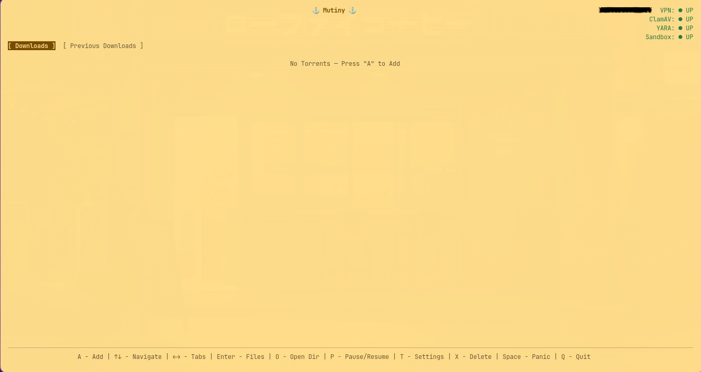
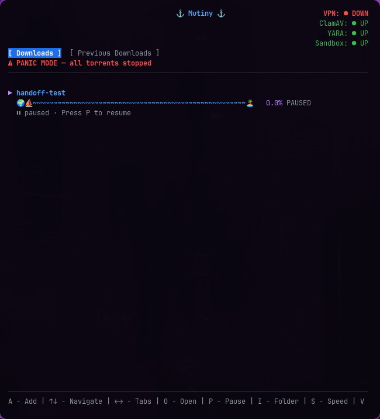
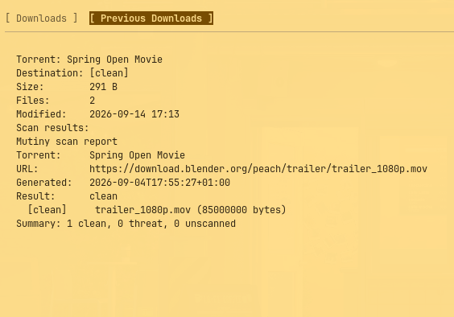
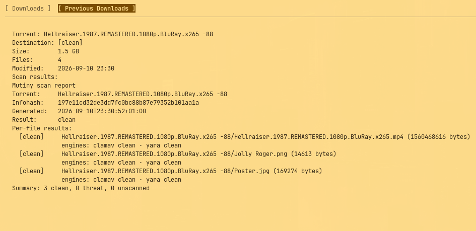

# ⚓ Mutiny

**Malware-aware BitTorrent client with VPN gating, dual-engine scanning, and staged delivery.**



<details>
<summary><strong>Screenshots</strong></summary>







</details>

[](https://github.com/Lumb3rH4ck/mutiny/releases)
[](LICENSE)
[]()
[]()

---

## Features

### Core
- **TUI + Web UI** — full terminal interface mirrors the browser; both have the same keybindings, themes, and live updates
- **Dual-engine scanning** — ClamAV + YARA on every file, with aggregated verdicts
- **Hash reputation** — SHA-256 checked against MalwareBazaar after a clean verdict (hashes only, no content leaves the machine)
- **Staged delivery** — downloads land in `scanning/` → `clean/` or `quarantine/`; partial files are 0600, quarantine is chmod 0000
- **On-the-fly scanning** — per-file scan as each file finishes, not only at download end
- **Per-file selection** — choose which files inside a torrent to download before anything starts (TUI picker, web picker, API); choice persisted across restarts

### Security
- **VPN gating** — auto-panic pauses all downloads when the tunnel drops; sockets pinned to the interface so traffic fails closed instead of leaking over the NIC
- **Containerized engines** — ClamAV + YARA run inside a Docker sandbox (read-only rootfs, no caps, no network)
- **Behavior sandbox** — executables run in an isolated throwaway container (strace capture, Linux only)
- **API token auth** — optional bearer token for state-changing calls; browser-friendly cookie auth for the web UI
- **MalwareBazaar hash check** — catches known-bad files even when engines are down

### Cross-Platform

| Feature | Linux | Windows |
|---------|:-----:|:-------:|
| TUI | ✅ | ✅ |
| Web UI + API | ✅ | ✅ |
| ClamAV + YARA scanning | ✅ | ✅ |
| Hash reputation | ✅ | ✅ |
| VPN gating + panic | ✅ | ✅ |
| VPN socket binding (SO_BINDTODEVICE) | ✅ | — |
| Containerized engines (Docker) | ✅ | ✅* |
| Behavior sandbox (strace) | ✅ | — |
| Re-seeding | ✅ | ✅ |
| Desktop notifications | ✅ | — |
| Systemd user service | ✅ | — |
| Omarchy shell widget | ✅ | — |

\* Docker Desktop on Windows; Windows containers not supported (Linux containers via WSL2).

### Extras
- **5 themes** — `pirate` (default), `cherry-blossom`, `neon`, `/home`, `coffee` — each with its own icon set
- **Built-in auto-update** — `freshclam` + YARA rules refreshed on a timer; binary self-update via `mutiny --update`
- **Re-seed delivered downloads** — toggle global or per-item via a dedicated seed client
- **Sea shanty loading screen** — plays a shanty while loading (configurable). Ships with bundled audio; custom files go in `~/.local/share/mutiny/shanty/`. Requires `mpv`, `ffplay`, or `ffmpeg` installed.
- **HTTP(S) direct links** — add any URL pointing at a `.torrent` file like a normal download

---

## Installation

### Arch Linux / Omarchy

**AUR** (recommended):
```bash
omarchy pkg aur add mutiny-bin
# or
paru -S mutiny-bin
```

**Omarchy shell widget** (shows active downloads in the bar):
```bash
omarchy pkg aur add omarchy-mutiny-status
# or
paru -S omarchy-mutiny-status
```
Then add it to the bar: `omarchy bar add mutiny.status --section right`

Toggle the widget on/off from Mutiny's settings: `T` → CUSTOMISATION → Omarchy Widget. The widget polls `/api/widget` and hides itself when disabled.

**One-line installer**:
```bash
curl -fsSL https://raw.githubusercontent.com/Lumb3rH4ck/mutiny/main/install.sh | sh
```

### Other Linux

**Download a release**:
```bash
VER=$(curl -fsSL https://api.github.com/repos/Lumb3rH4ck/mutiny/releases/latest | grep tag_name | cut -d'"' -f4)
curl -fsSL -o /tmp/mutiny.tar.gz \
  "https://github.com/Lumb3rH4ck/mutiny/releases/download/${VER}/mutiny_${VER}_linux_amd64.tar.gz"
tar -xzf /tmp/mutiny.tar.gz -C /tmp/
sudo cp /tmp/mutiny*/mutiny /usr/local/bin/mutiny
```

**Build from source**:
```bash
git clone https://github.com/Lumb3rH4ck/mutiny.git
cd mutiny
./dev.sh install    # builds + installs to ~/.local/bin/mutiny
```

### Windows

**winget**:
```powershell
winget install Lumb3rH4ck.Mutiny
```

**chocolatey**:
```powershell
choco install mutiny
```

**Download** — grab the `.zip` from [Releases](https://github.com/Lumb3rH4ck/mutiny/releases) and extract `mutiny.exe` anywhere on PATH.

---

## Uninstallation

### Arch Linux / Omarchy (AUR)
```bash
# Remove the main package
sudo pacman -Rns mutiny-bin

# Remove the widget (if installed)
sudo pacman -Rns omarchy-mutiny-status

# Remove runtime data (optional — keeps your downloads)
rm -rf ~/.config/mutiny
rm -rf ~/.local/share/mutiny
```

### Linux (install.sh / manual)
```bash
# Stop and disable the service
systemctl --user disable --now mutiny.service
rm -f ~/.config/systemd/user/mutiny.service

# Remove the binary
sudo rm -f /usr/local/bin/mutiny

# Remove desktop entries and icons
rm -f ~/.local/share/applications/mutiny.desktop
rm -f ~/.local/share/applications/mutiny-tui.desktop
sudo rm -f /usr/local/share/icons/hicolor/256x256/apps/mutiny.png
sudo rm -f /usr/local/share/icons/hicolor/48x48/apps/mutiny.png
sudo gtk-update-icon-cache /usr/local/share/icons/hicolor 2>/dev/null

# Remove runtime data (optional — keeps your downloads)
rm -rf ~/.config/mutiny
rm -rf ~/.local/share/mutiny

# Remove downloads and scan state (⚠️ deletes everything)
rm -rf ~/Downloads/Mutiny
```

### Windows
```powershell
# winget
winget uninstall Lumb3rH4ck.Mutiny

# chocolatey
choco uninstall mutiny
```

Or uninstall from **Settings → Apps → Installed Apps** → Mutiny → Uninstall.

### Clean Up (all platforms)
```bash
# Remove VPN panic interface binding (if set)
sudo ip link del surfshark_wg 2>/dev/null   # only if you created it manually

# Remove UFW rule (if added)
sudo ufw delete allow from 192.168.68.0/24 to any port 3030 proto tcp
```

---

## Quick Start

```bash
# TUI (terminal interface)
mutiny -mode tui

# Headless server (web UI + API on :3030)
mutiny -mode server

# Open the web UI
xdg-open http://127.0.0.1:3030
```

Or use the desktop entries: search "Mutiny" in your application launcher.

---

## Updating

```bash
# Self-update to the latest release (downloads, verifies, replaces the binary)
mutiny --update

# Then restart to use the new version
mutiny -mode tui
```

Package-managed installs (`winget`, `chocolatey`, `paru -Syu`) update through their respective package managers instead.

---
## Commands

```bash
mutiny -mode tui                              # Launch TUI
mutiny -mode server                           # Launch server (web UI + API)
mutiny -mode tui ~/Downloads/file.torrent     # Add torrent on launch
mutiny -mode tui "magnet:?xt=urn:btih:..."   # Add magnet on launch
mutiny --version                              # Print version
mutiny --update                               # Update to latest release and exit
mutiny --config ~/.config/mutiny/config.yaml  # Custom config path
mutiny -no-web-lan                            # Disable LAN serving
mutiny -no-web-tailscale                      # Disable Tailscale serving
```

---

## TUI Keybindings

| Key | Action |
|-----|--------|
| `a` | Add torrent / magnet / URL |
| `↑↓` / `jk` | Navigate |
| `←→` / `dp` | Switch pages |
| `enter` / `o` | Open download folder |
| `T` | Settings popup (themes, rates, toggles) |
| `f` | Re-open file picker |
| `r` | Re-scan (Previous Downloads page) |
| `s` | Toggle seeding (Previous Downloads page) |
| `g` | Refresh |
| `space` | Panic / resume |
| `q` / `ctrl+c` | Quit |

---

## Omarchy Shell Widget

The `mutiny.status` widget shows active download and threat counts in the Omarchy bar. It polls the Mutiny API every 5s and displays an anchor icon (⚓) normally, or a bolt (⚡) when threats are detected.

**Install**:
```bash
paru -S omarchy-mutiny-status     # AUR
# or copy manually:
mkdir -p ~/.config/omarchy/plugins/mutiny.status
cp manifest.json MutinyStatus.qml ~/.config/omarchy/plugins/mutiny.status/
```

**Add to bar**:
```bash
omarchy bar add mutiny.status --section right
```

The widget is visible only when Mutiny is running and has activity. Click it to open the web UI.

---

## Web UI & API

The web UI at `http://127.0.0.1:3030` mirrors the TUI. The REST API:

```bash
# List torrents (no auth)
curl -s http://127.0.0.1:3030/api/torrents

# Add a magnet (token required if api_token set)
curl -s -H "Authorization: Bearer $TOKEN" \
  -X POST -d '{"magnet":"magnet:?xt=urn:btih:..."}' \
  http://127.0.0.1:3030/api/torrents

# Add an http(s) URL
curl -s -H "Authorization: Bearer $TOKEN" \
  -X POST -d '{"url":"https://example.com/file.torrent"}' \
  http://127.0.0.1:3030/api/torrents

# Select which files to download
curl -s -H "Authorization: Bearer $TOKEN" \
  -X POST -d '{"files":["Sub/a.bin","readme.txt"]}' \
  http://127.0.0.1:3030/api/torrents/<id>/select

# Settings
curl -s -H "Authorization: Bearer $TOKEN" http://127.0.0.1:3030/api/settings
curl -s -H "Authorization: Bearer $TOKEN" -X POST -d '{"key":"theme"}' \
  http://127.0.0.1:3030/api/settings/cycle
```

---

## Firewall & System Rules

### UFW (Linux)
If `web_lan: true` but other devices time out on port 3030:
```bash
sudo ufw allow from 192.168.68.0/24 to any port 3030 proto tcp comment 'mutiny web ui'
```

### Windows Defender Firewall
Allow `mutiny.exe` through the firewall if LAN access is needed:
```powershell
New-NetFirewallRule -DisplayName "Mutiny Web UI" -Direction Inbound -Protocol TCP -LocalPort 3030 -Action Allow
```

### btrfs / COW Filesystems
If downloads stall at ~99.8% forever (piece hash loop):
```bash
sudo chattr +C -R ~/Downloads/Mutiny
```

### ClamAV Daemon (Linux)
```bash
sudo systemctl enable --now clamav-daemon.service
sudo systemctl enable --now clamav-daemon.socket
```

### Systemd User Service
```bash
systemctl --user enable --now mutiny.service
```

---

## Configuration

Config lookup: `--config` flag → `./config.yaml` → `~/.config/mutiny/config.yaml`.

| Key | Default | Description |
|-----|---------|-------------|
| `host` / `port` | `127.0.0.1` / `3030` | API bind address |
| `download_dir` | `~/Downloads/Mutiny` | Download root |
| `scan_dir` | `~/Downloads/Mutiny/scanning` | Scanning staging dir |
| `clean_dir` | `~/Downloads/Mutiny/clean` | Clean delivery dir |
| `quarantine_dir` | `~/Downloads/Mutiny/quarantine` | Threat quarantine dir |
| `clamav_socket` | `/var/run/clamav/clamd.ctl` | ClamAV daemon socket |
| `yara_rules_dir` | `~/.local/share/mutiny/rules` | YARA rules directory |
| `scan_container` | `` (local) | Docker container for scanning |
| `vpn_interface` | `surfshark_wg` | VPN interface to monitor. In-app setting cycles common options (`surfshark_wg`, `wg0`, `tun0`, `nordlynx`, `proton0`, `tailscale0`, etc.). Restart required. |
| `vpn_bind_interface` | `` | Pin torrent sockets to device |
| `api_token` | `` (off) | Bearer token for API auth |
| `theme` | `pirate` | TUI theme |
| `web_lan` / `web_tailscale` | `true` | Serve on LAN / Tailscale |
| `seed_completed` | `false` | Re-seed delivered downloads |
| `scan_timeout` | `20m` | Per-file engine deadline |

Full configuration reference: [Mutiny.md](Mutiny.md)

---

## Technical

### Architecture

```
                    VPN monitor
                      │  panic / recover
┌───────────┐  add   ┌──────────────┐  events   ┌──────────────┐
│ TUI / Web │ ─────► │  torrent.Man │ ────────► │  main.go     │
│(Bubble Tea)│       │  anacrolix   │           │  scanPath    │
└───────────┘        └──────┬───────┘           └──────┬───────┘
                            │                          │
                      ┌─────▼──────────────────────┐   │
                      │  Downloads/Mutiny/          │   │
                      │  scanning/ → clean/ | quar. │   │
                      └─────┬──────────────────────┘   │
                            │                          │
                      ┌─────▼─────────┐          ┌─────▼──────┐
                      │  scanner.New  │          │ state store│
                      │  clamdscan +  │          │  .state/   │
                      │  yara         │          │  state.json│
                      └───────────────┘          └────────────┘
```

### Build
- Pure Go, no cgo — cross-compiles to `linux/amd64`, `linux/arm64`, `windows/amd64`
- Web UI embedded via `//go:embed` (works from any CWD)
- GoReleaser builds, SBOM, checksums, cosign signing

### Dependencies

| Component | Dependency |
|-----------|------------|
| BitTorrent client | [anacrolix/torrent](https://github.com/anacrolix/torrent) v1.58.1 |
| TUI framework | [Bubble Tea](https://github.com/charmbracelet/bubbletea) + Bubbles + Lipgloss |
| WebSockets | [gorilla/websocket](https://github.com/gorilla/websocket) |
| Config | [yaml.v3](https://github.com/go-yaml/yaml) |
| ClamAV | System package (`clamav`) |
| YARA | System package (`yara`) or rules only |
| Container runtime | Docker (optional, for containerized scanning) |

### Build Dependencies
- Go 1.24+
- Docker (optional, for `scan_container` mode)
- `clamav` package (for ClamAV scanning)
- `yara` package (for YARA scanning)

### Directory Layout
```
~/Downloads/Mutiny/
├── clean/          # Clean deliveries (chmod 0644)
├── quarantine/     # Threat files (chmod 0000)
├── scanning/       # Staging / unscanned
└── .state/         # State store (state.json)
```

### Scan Flow
1. Add torrent → files stream to download root
2. Per-file scan (ClamAV + YARA) as each file completes
3. SHA-256 reputation check against MalwareBazaar
4. Download completes → relocate to `scanning/`
5. Aggregate verdict → `clean/` or `quarantine/`
6. `scan_report.txt` written next to delivered files

### Security Model
- Fail-closed: no single-engine `clean` verdict
- Partial files 0600, clean 0644, quarantine 0000
- VPN socket binding (`SO_BINDTODEVICE`, Linux)
- Engine sandboxing via Docker (read-only, no caps, no network)
- API token constant-time comparison
